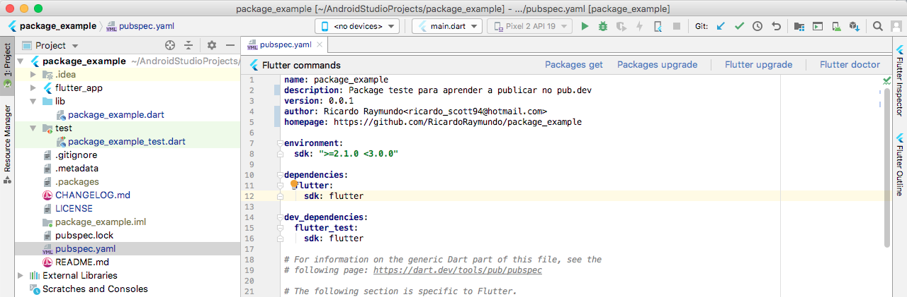
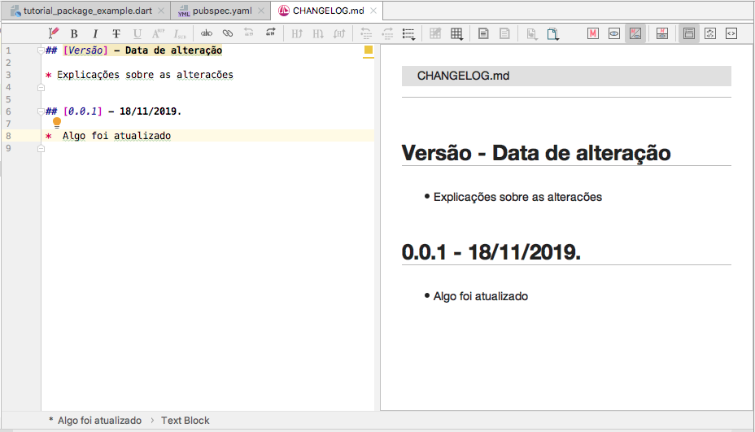
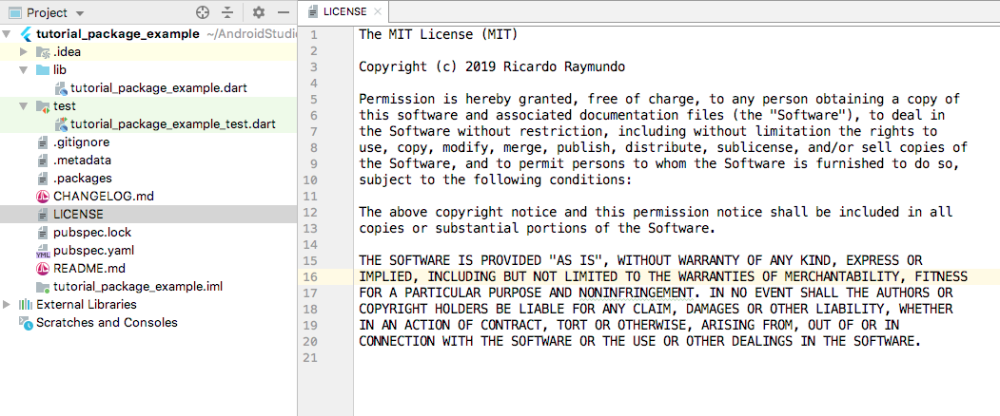
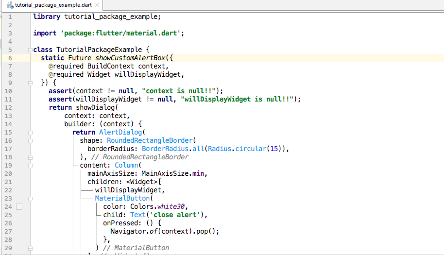
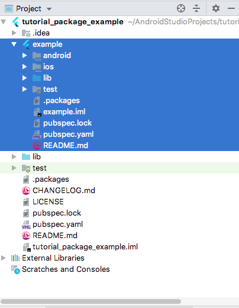

# Manual de publicar pacotes [Pub.Dev](https://pub.dev/)


## **Conteúdo**

1. [Passo à passo](#passo-à-passo)
2. [Aprender](#aprender)
3. [Contribuir](#contribuir)
4. [Licença](#licença)

## Passo-à-passo

#### 1. Criar package

  ```
  flutter create --template=package nome_do_pacote
  ```


#### 2.  Publicar o pacote no GitHub

    

#### 3.  pubspec.yaml:





Preencher o cabeçalho do pubspec.yaml, por exemplo:
```.yaml

name: nome_do_pacote
description: Package criado para tutorial de publicação no pub.dev
version: 0.0.1
author: Ricardo Raymundo<ricardo_scott94@hotmail.com>
homepage: https://github.com/RicardoRaymundo/nome_do_pacote
```
É preciso definir sua versão inicial seguindo o padrão de [Versionamento Semântico](https://semver.org/lang/pt-BR/):

MAJOR.MINOR.PATCH = 0.0.0


*   Versão Maior(MAJOR): quando fizer mudanças incompatíveis na API.
*   Versão Menor(MINOR): quando adicionar funcionalidades mantendo compatibilidade.
*   Versão de Correção(PATCH): quando corrigir falhas mantendo compatibilidade.

 


#### 4.  CHANGELOG.md:





Em CHANGELOG.md são registradas as versões do pacote, exemplo:
```.markdown
**## [_Versão_] - Data de alteração**

*Explicações sobre as alterações
```


#### 5.  LICENSE





*   Escolher uma licença open source em [choosealicense.com](https://choosealicense.com/) 
*   Neste tutorial é usada a [licença MIT](https://choosealicense.com/licenses/mit/)
*   Registrar a licença no arquivo LICENSE na raiz do pacote
#### 6.  Código do pacote





Implementar o código fonte do pacote na pasta lib. [Código utilizado](https://gist.github.com/onatcipli/fa4d7d9c33d07067de62241dae98b5ea#file-custom_alert_box-dart)


#### 7.  Criando o exemplo
 1. Criar uma aplicação Flutter na pasta exemplo do pacote





2. Importar o package no **pubspec.yaml** da aplicação

    dependencies:


     ...


     nome_do_pacote:


       path: ../


...  


3.  Publicar o pacote em pub.dev 

    Executar o seguinte comando para verificar se há falhas:


    ```
    flutter packages pub publish --dry-run
    ```


    Execute o comando para publicar o pacote:


    ```
    flutter packages pub publish
    ```


    Confirme a publicação pelo seu email e então o pacote está finalmente publicado!

#### 9. Atualizando o pacote

   [https://dart.dev/tools/pub/publishing](https://dart.dev/tools/pub/publishing)


   Antes de executar o comando de atualizar pacote, é preciso atualizar sua versão seguindo o padrão de [Versionamento Semântico](https://semver.org/lang/pt-BR/):


Para atualizar o pacote:


```
    pub publish
```


#### 10. Colaboradores

Para permitir que outros desenvolvedores colaborem:


```
    pub uploader add ciclano@gmail.com
```


   Para escolher especificamente o pacote para adicionar um colaborador:


```
    pub uploader --package=package_name add deltrano@example.com
```


   Para remover colaboradores:


```
    pub uploader remove fulano@hotmail.com
```


## **Aprender**

[https://medium.com/flutter-community/how-to-create-publish-and-manage-flutter-packages-b4f2cd2c6b90](https://medium.com/flutter-community/how-to-create-publish-and-manage-flutter-packages-b4f2cd2c6b90)

[https://medium.com/nonstopio/create-flutter-package-and-publish-to-dart-packages-timer-button-8a407440a5da](https://medium.com/nonstopio/create-flutter-package-and-publish-to-dart-packages-timer-button-8a407440a5da)

[https://dart.dev/guides/libraries/create-library-packages](https://dart.dev/guides/libraries/create-library-packages)

[https://dart.dev/tools/pub/publishing](https://dart.dev/tools/pub/publishing)

[https://flutter.dev/docs/development/packages-and-plugins/developing-packages](https://flutter.dev/docs/development/packages-and-plugins/developing-packages)


## **Contribuir**

Contribuições são sempre muito bem vindas! Não precisam ser somente através de desenvolvimento de código, qualquer ajuda com ideias, sugestões, melhorias na documentação e doações são sempre muito apreciadas!

Participe da comunidade [Projeto que Vale](http://www.projetoquevale.com.br/) e colabore da forma que achar melhor.


## **Licença**

MIT License

Copyright (c) 2018 PROJETO QUE VALE

É concedida permissão, gratuitamente, a qualquer pessoa que obtenha uma cópia deste software e dos arquivos de documentação associados (o "Software"), para negociar o Software sem restrições, incluindo, sem limitação, os direitos de uso, cópia, modificação e fusão , publicar, distribuir, sublicenciar e / ou vender cópias do Software, e permitir que as pessoas a quem o Software é fornecido o façam, sujeitas às seguintes condições:

O aviso de copyright acima e este aviso de permissão devem ser incluídos em todas as cópias ou partes substanciais do Software.

O SOFTWARE É FORNECIDO "NO ESTADO EM QUE SE ENCONTRA", SEM NENHUM TIPO DE GARANTIA, EXPRESSA OU IMPLÍCITA, INCLUINDO, MAS NÃO SE LIMITANDO ÀS GARANTIAS DE COMERCIALIZAÇÃO, ADEQUAÇÃO A UM FIM ESPECÍFICO E NÃO VIOLAÇÃO. EM NENHUMA CIRCUNSTÂNCIA, OS AUTORES OU PROPRIETÁRIOS DE DIREITOS DE AUTOR PODERÃO SER RESPONSABILIZADOS POR QUAISQUER REIVINDICAÇÕES, DANOS OU OUTRAS RESPONSABILIDADES, QUER EM ACÇÃO DE CONTRATO, DELITO OU DE OUTRA FORMA, DECORRENTES DE, OU EM CONEXÃO COM O SOFTWARE OU O USO OU OUTRAS NEGOCIAÇÕES NO PROGRAMAS.


<!-- Docs to Markdown version 1.0β17 -->
